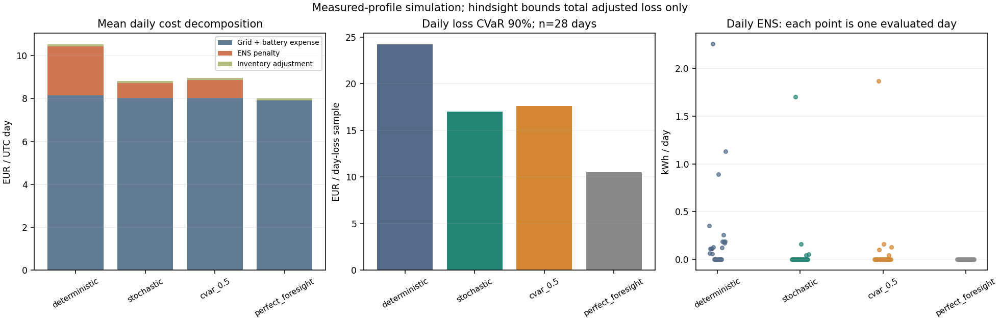
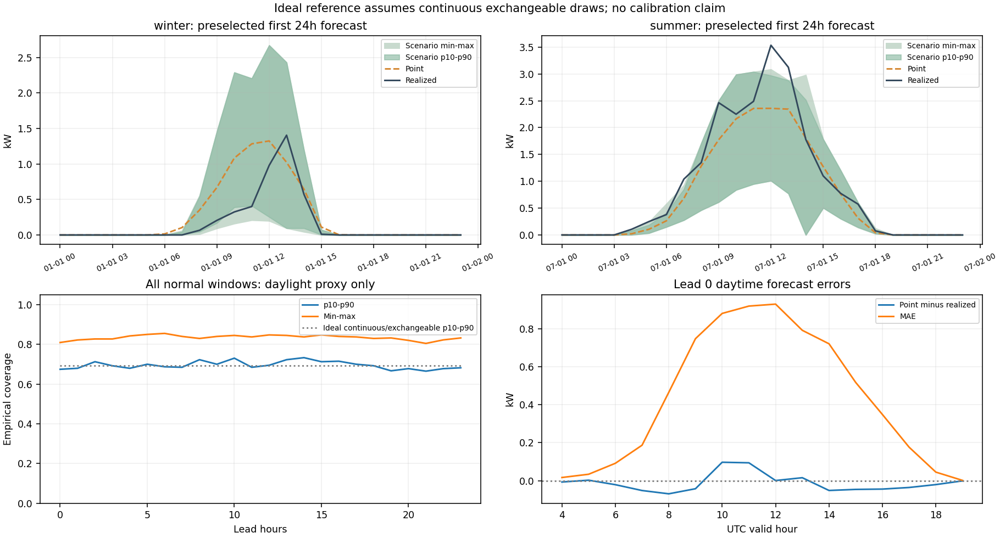
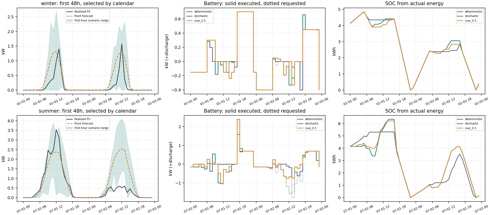
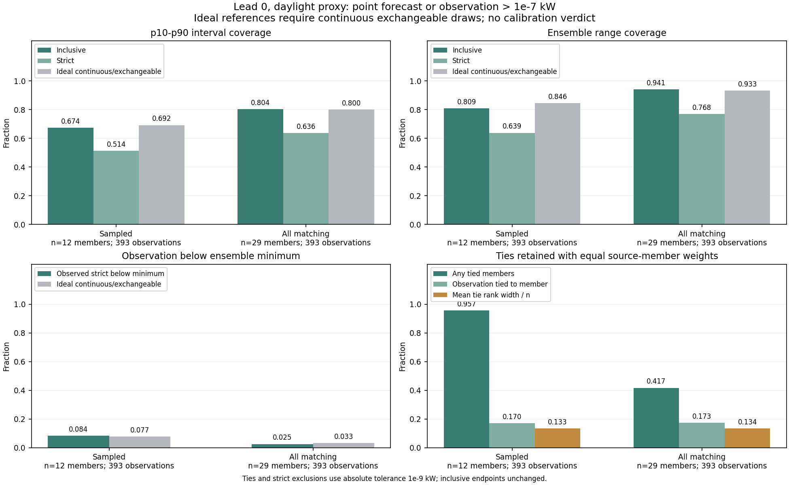
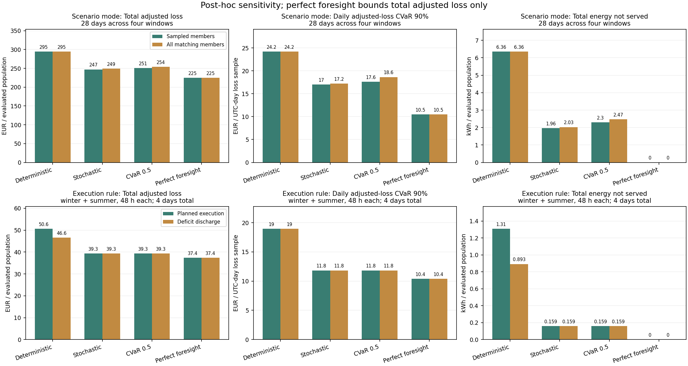

# EcoGrid-Quant

**光伏预测不确定性下，电池与有限容量电网的风险感知调度。**
个人研究作品，使用 Python、Pyomo 和 HiGHS，比较确定性、风险中性随机与 CVaR 策略。
重点是可追溯的数据、因果决策、真实执行守恒，以及对无收益结果的解释。

本版已跑通 **OPSD 原始实测光伏驱动的 28 天仿真**，覆盖四个季度。
风险中性策略优于本次确定性基线；CVaR（λ=0.5）没有额外改善，反而略增费用和缺电。
这不是实站部署，也不足以证明长期或统计显著的策略排名。
收尾已完成：全部历史候选情景及独立执行规则对照仍未显示稳定的 CVaR 额外收益。
这些是看过原结果后的敏感性研究，原28天数据不构成新的独立验证。

## 运行

在仓库根目录、已有 `ecogrid` 环境中运行，无需 Notebook：

```powershell
conda activate ecogrid
# 本轮收尾：保留原结果，单独运行事后情景/执行规则敏感性
python -B -m ecogrid --config configs/mechanisms.json --source measured --output results/mechanisms
# 从完成的账本生成图；不再求解优化问题
python -B -c "from pathlib import Path; from ecogrid.diagnostics import write_mechanism_figures; write_mechanism_figures(Path('results/mechanisms'))"
# 完全离线的合成快速演示：48h正常期与48h压力期
python -B -m ecogrid --config configs/quick.json --source synthetic --output results/quick
# 较长合成演示：168h正常期与72h压力期，24情景
python -B -m ecogrid --config configs/long.json --source synthetic --output results/long
```

收尾命令需要已完成的原研究账本及校准元数据，审阅包提供必要的原主比较账本。
原 `configs/measured.json` 仍保留，重新运行原协议时须另选输出目录，不能覆盖 `results/study`。
实测输入首次联网获取官方原始 ZIP 中约 3 MB 的压缩成员，解压缓存约 9.4 MB；
之后校验缓存即可离线运行。服务器必须支持 HTTP Range；下载或质量检查失败会明确退出。
完成的策略有哈希检查点，同一代码、数据和配置可续跑；代码/参数改变时使用新输出目录。
原 `results/study` 被收尾流程作为只读证据使用，不拿当前代码续跑它。

本机实际解释器为 `C:\Users\Averyhong\miniconda3\envs\ecogrid\python.exe`，
Python 3.10.20、Pyomo 6.10.0、HiGHS 1.14.0。没有重建环境或升级依赖。
其他机器的依赖定义见 [pyproject.toml](pyproject.toml)，可在自己的环境安装
`pip install -e ".[dev]"`。审阅 ZIP 另含本次直接依赖版本清单。

## 问题 → 预测 → 情景 → 优化 → 执行 → 评价

电网有限时，电池该为预测偏差留多少电？先以训练期时刻均值和最近七天同一时刻均值
各占 50% 构造预测，再按起报小时抽取历史 **24h 完整残差块**，保留误差时序相关性。
每小时用当前可见信息重算未来 24h，只有当前电池请求跨情景共享；未来允许整路径
追索，是两阶段规划近似，不宣称多阶段最优。当前小时实际 PV 不进入决策输入。

实际供给出现后，同一个负荷优先保护规则执行请求：缺电时先削减充电，电网补足
剩余需求，记录弃光与 ENS。SOC 由真实充放电更新，不用 clip 隐藏能量缺口。
电池 8 kWh / 3 kW、效率各 0.95、初态 4 kWh；进口上限默认 2.5 kW。
负荷、电价、资产参数为已知外生设定，只有 PV 不确定，时间统一 UTC。

优化目标是 `(1-λ) E[C_24h] + λ CVaR₀.₉[C_24h]`，其中路径损失包含购电、
电池吞吐成本（0.01 EUR/kWh）、缺电惩罚（10 EUR/kWh）与终端库存估值（0.18 EUR/kWh）。
主比较固定 λ=0 和 0.5、12 等权情景、种子 42，未按测试结果调参。
λ=1 单独做对照：先最小化 CVaR，再在最优尾部值 +1e-7 EUR 内最小化期望成本，
明确处理非尾部最优解不唯一；保留未处理版本供比较。

费用和风险分开：

```text
实际基础费用 = 购电费用 + 实际电池吞吐使用成本代理
调整后损失 = 实际基础费用 + 缺电惩罚 - 0.18 × SOC变化
```

“实际基础费用”含使用成本代理，不能全部视为现金账单。小时库存项求和等于完整期
终端调整。规划 CVaR 是一次起报的条件情景 24h 总损失；报告的小时/日风险来自
不断重算后的实际执行样本，二者不同。VaR 统一为下分位数，CVaR 独立按最差概率
质量复算，正确纳入边界上的部分质量，不读取求解器辅助阈值作为报告风险。

完整公式、代码函数对应、手算例与面试追问见 [模型说明](docs/MODEL_SPECIFICATION.md)。
[研究范围](docs/PROJECT_SCOPE.md) 保留项目边界，不充当完成度声明。

## 实测数据与预设评估

数据来自 [OPSD Household Data 2020-04-15](https://data.open-power-system-data.org/household_data/2020-04-15/)，
`DE_KN_residential6_pv`，署名 Open Power System Data (2020)、CoSSMic / ISC Konstanz，CC BY 4.0。
已核实官方小时 CSV 仍是累计 kWh，且插补标记不能涵盖发布流程的短间隔插值和
全序列清理。因此正式实验直接读取官方原始电表 `feed_43.MYD`，依据
[官方解码代码](https://github.com/isc-konstanz/household_data/blob/2020-04-15/household/read.py)
解析 UTC 秒与累计 kWh；原始文件 SHA256 固定校验。

在每个整点取不晚于边界的最近真实读数，两端均须不超过 180 秒陈旧，只差分一次，
乘事先声明的 0.5 缩放，再除以名义 1h 得 kW。没有插补、压缩缺失日历或用测试
最大值归一化；5 kW 是仿真上界，不是核实过的铭牌容量。实际计量跨度为
3490–3665 秒，被分配给名义小时，属于明示的边界对齐近似。

所有质量合格时段在策略运行前固定：**2017-01-01、04-01、07-01、10-01 各连续七天**。
每段此前 60 天训练、30 天校准；训练/残差仅用当时可用的观测。历史通信时刻未知，
保守假设小时 `t` 的 PV 在 `t+2h` 可用，SOC 则假定可直接测量。每段首次拟合
1439 小时、冻结 696 个残差块；测试残差不参与校准。四季窗口均保留完整小时，
没有缺测或离线插补；端点最大滞后为 103/78/160/104 秒。

观测发电当作“可用 PV”仍是近似，不能识别历史限电和停机。数据是实测，
负荷、电价、配置、通信延迟与执行条件是仿真假设。

## 原28天结果：sampled-12，保留

主比较每策略 **672 小时 / 28 个不同 UTC 日**。下表费用为全 28 天 EUR，
ENS 为全期 kWh；各七天窗口从相同初态重新开始。

| 策略 | 实际基础费用 | 缺电惩罚 | 库存调整 | 调整后损失 | ENS |
|---|---:|---:|---:|---:|---:|
| 确定性 | 228.290 | 63.561 | 2.692 | 294.542 | 6.356 |
| 风险中性 | 224.838 | 19.635 | 2.692 | 247.165 | 1.963 |
| CVaR，λ=0.5 | 225.071 | 23.005 | 2.692 | 250.768 | 2.301 |
| 完美预知参考 | 221.858 | 0.000 | 2.692 | 224.550 | 0.000 |

| 策略 | 平均小时损失 (EUR/h) | 小时 CVaR₀.₉ (EUR/小时样本) | 平均日损失 (EUR/day) | 日 CVaR₀.₉ (EUR/日样本) |
|---|---:|---:|---:|---:|
| 确定性 | 0.4383 | 1.4851 | 10.5194 | 24.1998 |
| 风险中性 | 0.3678 | 0.8987 | 8.8273 | 17.0320 |
| CVaR，λ=0.5 | 0.3732 | 0.9453 | 8.9560 | 17.5978 |
| 完美预知参考 | 0.3342 | 0.6180 | 8.0196 | 10.5062 |

90% 尾部只有 **67.2 个等效小时 / 2.8 个等效日**，且有时序相关性。
本次窗口从午夜开始，UTC 日与非重叠 24h 块完全重合；两种表仍分别保存。
不是把各周 CVaR 平均，也不把不同种子或压力重复计入 28 天样本。
完美预知只对同约束、同完整评估期的**总调整后损失**给下界，
不能当作小时/日 CVaR、ENS、购电量或实际费用的普遍下界。





### 为什么出现这个结果

CVaR 相对风险中性多出 **3.603 EUR** 调整后损失，其中基础费用增加 0.233，
缺电惩罚增加 3.370，完整期库存项相同。日损失尾部中，风险中性的购电/电池/
缺电/库存贡献为 **10.091 / 0.075 / 6.652 / 0.214 EUR**；CVaR 策略为
**10.080 / 0.073 / 7.231 / 0.214 EUR**。额外尾部主要来自缺电，价格并非随机输入。
这些贡献在同一损失尾部取样，可相加；各分项自己的 CVaR 不能这样相加。

- **有限成员的误差事件。** 首小时日间共 393 个观测，p10–p90 覆盖率为 67.43%，
  33 小时（8.40%）实际 PV 低于全部 12 个情景；这些数字不能单独证明失准。
  理想连续、可交换的13个样本下，越过12成员下界的参照为1/13（7.69%）；
  当前下分位数区间取第2与第11顺序统计量，覆盖参照为9/13（69.23%），不是80%。
  实际数据有放回抽样、并列值、截断、时序相关与日间筛选，因此也不能反推已校准。
  春季覆盖为56.04%。作为具体执行机制例子，04-01 07Z 实际 PV
  0.199 kW 低于情景最小值 0.306，CVaR 有 4.337 kWh 电量但请求零放电，产生
  0.101 kWh 缺电；风险中性预先请求 0.142 kW 放电，避免缺口。
- **跨小时库存比单次大动作更重要。** 冬季 01-07 09–10Z，CVaR 少充 0.179408 kWh，
  乘两次 0.95 效率，正好对应该周多出的 0.161916 kWh ENS。夏季 07-03 19Z
  虽多放电 2.467 kW，基础费用下降 0.469 EUR 却几乎被库存调整抵消，损失仅降 0.0013。
- **保护会消除部分请求差异。** 四季有 171 小时请求不同，其中 10 小时执行相同。
  夏季 07-02 13Z 两个充电请求 1.470/1.086 kW 都被实际供给限制为 0.745。
  原执行规则只缩减请求，不会自动追加放电；它不能修复所有漏覆盖风险。

上述小时是对完整结果的事后机制诊断，不用于选评估窗口或参数，也不代替全期比较。
冬季晚间的差异源于先前库存，不能把所有差异都归因于当前预测错误；账本也不能
单独证明求解器对某条未来路径的偏好原因。预选冬夏首48h图仍原样保留。

### 小型边界实验：没有稳定的 CVaR 优势

所有窗口/种子/容量在求解前固定。以下只比较同一时长、同初态的结果；
金额为各窗口**总调整后损失 EUR**，不会把单日对照与七天平均相减。

| 对照 | 确定性 | 风险中性 | CVaR λ=0.5 | 解释 |
|---|---:|---:|---:|---|
| 冬首24h，电网2.0 kW | 85.327 | 81.952 | 81.952 | 两随机策略及完美预知均缺电7.281 kWh，容量约束主导 |
| 夏首24h，电网2.0 kW | 8.801 | 10.522 | 10.550 | 随机策略也可能更差；ENS为0.124/0.297/0.297 kWh |
| 夏首24h，电网3.0 kW | 7.740 | 7.478 | 7.455 | 均无缺电，CVaR小幅改善总损失，并未改善小时尾部 |
| 冬首48h，低PV/偏高预测压力 | 30.894 | 30.926 | 30.914 | 三策略ENS均1.027 kWh，无额外可靠性收益 |
| 夏首48h，同一压力规则 | 46.715 | 56.545 | 48.969 | CVaR比风险中性少缺0.767 kWh，但仍差于确定性 |

压力规则为实际 PV ×0.2、正值点预测 +0.75 kW，校准库不变；这是人工分布偏移，
不是历史极端事件。冬夏共4个压力日，与28个正常日分开统计。
种子 42/7/99 的夏首24h，CVaR 相对风险中性的总损失差分别为
**−0.0226 / +0.0063 / +0.0316 EUR**，均无缺电，收益方向随抽样改变。

λ=1 的冬/夏首24h对照也未显示额外收益：平局处理后的实际损失为 10.390/7.734 EUR，
相较原始纯CVaR仅变化 0/−0.000031 EUR。二次求解却消除了大量未执行未来追索中的
非尾部冗余：每次规划期望损失平均下降 0.593/1.503 EUR，尾部保持在声明容差内。
这说明平局处理有助于明确模型解的含义，不能把规划账面的改善当成实际收益。

**适用判断：** 本组数据支持先使用风险中性作为简单参考。CVaR 在夏季压力例中
有条件收益，但未持续胜过风险中性或确定性。更紧容量下可能无能为力，容量充裕时
收益很小；没有证据支持为这组常态结果付出额外风险优化复杂度。保留这个负结果，
不继续调测试集、增加模型或更换指标来制造胜出。

## 收尾敏感性：情景与执行机制

原28天结果保留不覆盖。新实验只改变一个因素：四季各七天比较情景模式；
另在原冬、夏首48h比较执行规则，仍用sampled-12，不与全部候选模式组合。
确定性和完美预知的28天结果经输入、源码及执行账本核验后复用；
sampled-12随机策略重新运行并复现原动作、SOC与损失。原容量、种子、压力扫描未重跑。

### 全部候选并没有带来额外收益

`all_matching` 每次使用所有合格同 UTC 起报小时的历史残差来源，每个来源一次、
等权；重复路径仍保留原概率质量。本次四季×24起报小时的实际候选数均为 **29**，
由校准库计算，代码不固定这个数字。优化的90%尾部从12条抽样的 **1.2** 个等效
来源变为29条的 **2.9** 个；这不增加历史信息，也不增加独立尾部事件。

下表费用为全28天 EUR；购电与电池两项之和是实际基础费用。

| 情景 / 策略 | 购电 | 电池使用 | 缺电惩罚 | 库存调整 | 调整后损失 |
|---|---:|---:|---:|---:|---:|
| sampled-12 / 风险中性 | 221.795 | 3.043 | 19.635 | 2.692 | 247.165 |
| all_matching / 风险中性 | 223.955 | 2.466 | 20.272 | 2.692 | 249.385 |
| sampled-12 / CVaR 0.5 | 222.066 | 3.004 | 23.005 | 2.692 | 250.768 |
| all_matching / CVaR 0.5 | 223.793 | 2.605 | 24.705 | 2.665 | 253.768 |

| 情景 / 策略 | ENS (kWh) | 日损失 CVaR₀.₉ (EUR/日样本) | 本轮求解 (秒) |
|---|---:|---:|---:|
| sampled-12 / 风险中性 | 1.963 | 17.032 | 194.7 |
| all_matching / 风险中性 | 2.027 | 17.229 | 641.7 |
| sampled-12 / CVaR 0.5 | 2.301 | 17.598 | 206.4 |
| all_matching / CVaR 0.5 | 2.470 | 18.643 | 681.7 |

两种随机策略在全部候选下均略差，求解约慢3.3倍；CVaR相对风险中性的额外损失
从3.603增至4.382 EUR。因此本组结果不能仅归因于12条抽样，也没有证据支持
为这些窗口采用更昂贵的CVaR或全部候选模式。这个有限对照不证明它们普遍无效。
确定性与完美预知仍为294.542 / 224.550 EUR，见原表。
日尾部仍只有2.8个等效日；小时及日ENS风险、购电量、弃光和吞吐量均保存在
[收尾汇总表](docs/results/mechanisms/mechanism_summary.csv)。

### 有限成员诊断：覆盖变高不等于校准成功

同一批首小时日间观测共393个。区间端点与下分位数定义保持不变；
严格覆盖排除端点并列，1e-9 kW容差只用于识别并列和严格排除，不扩大区间。

| 诊断 | sampled-12 | all_matching（本次29） |
|---|---:|---:|
| p10–p90含边界覆盖 | 67.43% | 80.41% |
| p10–p90严格覆盖 | 51.40% | 63.61% |
| 理想连续可交换覆盖参照 | 9/13 = 69.23% | 24/30 = 80.00% |
| 低于全部情景 | 33/393 = 8.40% | 10/393 = 2.54% |
| 理想连续可交换下界越过参照 | 1/13 = 7.69% | 1/30 = 3.33% |
| 观测与成员并列 | 17.05% | 17.30% |
| 成员内部存在并列 | 95.67% | 41.73% |

成员数改变了有限秩参照，放回抽样和截断又产生大量并列；时序相关及日间筛选
也使理想可交换假设不成立。33次下穿本身不能证明失准；全部候选的80.41%
也不能证明已校准。完整表另列严格越界、边界并列、观测秩区间及归一化区间宽度，
不把确定性秩中点当作随机化PIT或显著性检验。



### 追加放电：冬季改善，夏季缺电被推迟

控制对照允许实际缺口出现时追加SOC与功率允许的放电，并将真实SOC送回后续
每小时优化。原规则仍是默认；这是小时平均执行规则的反事实，未验证实时控制，
也不是原优化器建模的最优应急追索。四策略采用相同规则，完美预知重新求解完整48h。

| 策略 | 原规则→追加放电总损失 (EUR) | ENS (kWh) | 日损失 CVaR₀.₉ (EUR/日样本，两规则相同) |
|---|---:|---:|---:|
| 确定性 | 50.646 → 46.566 | 1.310 → 0.893 | 18.970 |
| 风险中性 | 39.322 → 39.322 | 0.159 → 0.159 | 11.829 |
| CVaR 0.5 | 39.296 → 39.296 | 0.159 → 0.159 | 11.829 |
| 完美预知参考 | 37.422 → 37.422 | 0.000 → 0.000 | 10.388 |

这里每策略只有冬、夏各48h，共4日、0.4个等效尾部日，不能并入28天增加样本量。
确定性的基础费用36.198→36.288、缺电惩罚13.102→8.932、库存调整均1.346 EUR；
改善来自冬季ENS的0.420→0.003 kWh。两随机策略完整期各费用项没有实质变化。

夏季三策略均追加过放电，却未减少全期ENS。以风险中性07-02为例，17Z与18Z
避免0.110142+0.049316 kWh缺电，但库存下降后22Z新增0.159459 kWh缺电，
恰好抵消。完整回放揭示的是跨小时转移；不能把当前小时避免的缺口当成净收益。
总追加量还受后续请求变化影响，不能直接等同于避免的ENS。



本轮48条策略记录中26条重新求解、22条核验后复用，总墙钟1839秒（约30.7分钟）。
复用记录的本轮求解时间为0，原计时另存，不能据此比较算法速度。
核对6144行账本，最大物理/记账残差低于2e-15；240行风险汇总另用排序及部分
尾部质量独立复算，最大差异低于4e-15。1440组随机策略配对的整条情景哈希一致。
原111份结果文件逐字节保留；结论止于本次事后敏感性，不继续扩模型或挑指标。

## 结果表与复现

正式小型快照在 [docs/results/](docs/results/)，完整运行账本和缓存留在本地并被 Git 忽略。
实测命令生成：

| 文件 | 内容 |
|---|---|
| `summary.csv` | 每个窗口/策略的成本、全期可比 regret、ENS、购电、弃光、吞吐量、求解时间 |
| `hourly.csv` / `daily.csv` / `blocks24.csv` | 请求、执行、SOC、分项记账，以及完整块标记 |
| `risk_summary.csv` | 小时/日/24h块的基础费用、惩罚、库存、损失与 ENS 风险，含样本及尾部数量 |
| `tail_attribution.csv` | 同一调整损失尾部中的成本分解；不是相加各成本独立 CVaR |
| `action_comparison.csv` / `forecast_diagnostics.csv` | 匹配条件下动作差异、保护合并、分 lead 日间情景覆盖与误差 |
| `representative_hourly.csv` | 预选冬夏首48h、四策略的精简审阅账本 |
| `protocol.json` / `manifest.json` | 事前日期/配置、来源/变换、源码与输入哈希、版本、完成状态及检查点 |
| `comparison.png` / `forecast.png` / `dispatch.png` | 原比较与代表性调度；预测图已纠正有限成员参照 |
| `mechanism_summary.csv` / `candidates.csv` | 新情景/执行规则汇总及各起报小时真实候选数 |
| `mechanisms.png` / `finite_ensemble.png` | 新的单因素比较、有限成员及并列诊断 |
| `verification.json` | 收尾账本、独立风险、原文件哈希核验记录 |

纯求解计时包括构模、求解和约束核对，不含下载、预测与绘图；主比较约为确定性
25 秒、风险中性 191 秒、CVaR 204 秒，依机器负载变化。只接受 optimal 且残差
不超过 1e-6 的结果，失败会留在 manifest，不会用零动作或合成数据代替。
原实验整组66次策略回放约704秒（不含首次数据获取）。原4080行执行账本的最大能量、
平衡及记账残差均小于2e-15；435行风险汇总另用排序与部分尾部质量独立核对。

合成/历史天气入口仍保留；`--source public` 使用 Open-Meteo 历史辐射估算 PV，
**不是电站实测，也不是历史发布预报**。先前快速/较长演示结果不与本次正式实测表混合。

## 目录、检查与限制

```text
ecogrid/data/benchmark.py   合成与历史天气代理
ecogrid/data/measured.py    官方原始电表、单位、质量与可用时间
ecogrid/forecast.py         因果点预测与整块残差情景
ecogrid/dispatch.py         共用物理模型、风险目标与纯CVaR平局处理
ecogrid/simulation.py       实际执行与能量/费用账本
ecogrid/evaluation.py       滚动回放、完美预知及多尺度风险
ecogrid/study.py            固定实测实验与可校验续跑
ecogrid/diagnostics.py      有限成员诊断、成本解释与结果图
configs/                   quick.json、long.json、measured.json、mechanisms.json
data/raw/、results/         原始缓存、完整结果（不入Git）
docs/                      scope、模型说明、正式小表和图
tests/                     少量关键性质与回归检查
archive/notebooks/         旧原型Notebook，原样归档
```

```powershell
python -B -m pytest tests/test_forecast.py tests/test_dispatch.py tests/test_evaluation.py tests/test_study.py -p no:cacheprovider -o addopts= -q
ruff check .
mypy ecogrid
```

原版全套74项检查通过；本轮运行相关的31项检查通过，Ruff / Mypy 通过。
新增检查集中于全候选来源权重、有限成员/并列秩、追加放电与下一小时SOC。
既有检查覆盖能量守恒、无来源充电、共享当前请求、
延迟观测与残差冻结、原始电表差分/缺口、离散风险及平局处理、完整日块与公平记账。
测试不证明研究结论显著；其他操作系统与 CI 矩阵未在本机验证。

旧 `core/`、`ecogrid/engines/`、`backtest.py`、`scenarios.py` 仅为历史兼容保留，
不属于当前主线；旧滚动执行、风险与物理约束存在限制，旧 Notebook 输出不作为证据，
见 [归档说明](archive/notebooks/README.md)。

局限包括单电站与仅28天测试、情景可交换性和校准性未确证、简单预测、整路径追索近似、固定
库存估值和使用成本、小时平均保护规则。没有验证小时内控制、真实通信条件、
长期经济性、年度极端天气、多站稳定性或统计显著性；本次没有为改善 CVaR 排名而调参。
